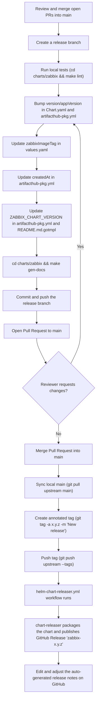

# Helm Zabbix

[](https://opensource.org/licenses/Apache-2.0) [](https://somsubhra.github.io/github-release-stats/?username=zabbix-community&repository=helm-zabbix&page=1&per_page=500#) [](https://github.com/zabbix-community/helm-zabbix/releases)

<!-- TOC -->

- [Helm Zabbix](#helm-zabbix)
  - [About this chart](#about-this-chart)
  - [Contributing](#contributing)
  - [Examples](#examples)
  - [Important links](#important-links)
    - [Related to this helm chart](#related-to-this-helm-chart)
    - [Related to Zabbix](#related-to-zabbix)
  - [Repository structure](#repository-structure)
  - [Release process](#release-process)
  - [Contributors](#contributors)
    - [Maintainers](#maintainers)
  - [History](#history)
  - [License](#license)

<!-- TOC -->

## About this chart

See the [charts/zabbix/README.md](charts/zabbix/README.md) file to learn more about this helm chart or access [Artifact Hub](https://artifacthub.io/packages/helm/zabbix-community/zabbix).

> This Helm chart installs [Zabbix](https://www.zabbix.com) in a Kubernetes cluster. It supports only Postgresql/TimescaleDB as a database backend at this point in time, without any plans to extend database support towards MySQL, MariaDB, etc. Also, this Helm Chart supports [Zabbix Server High Availability](charts/zabbix/#native-zabbix-server-high-availability)

## Contributing

See the [CONTRIBUTING.md](CONTRIBUTING.md) file to learn how to contribute to this helm chart.

## Examples

See the [charts/zabbix/docs/example/README.md](charts/zabbix/docs/example/README.md) file to install this helm chart in [kind](https://kind.sigs.k8s.io) cluster.

## Important links

### Related to this helm chart

- Open issue, bug or feature request: https://github.com/zabbix-community/helm-zabbix/issues
- Ask help: https://github.com/zabbix-community/helm-zabbix/discussions
- Releases and Changelog: https://github.com/zabbix-community/helm-zabbix/releases
- Artifact Hub: https://artifacthub.io/packages/helm/zabbix-community/zabbix
- Closed issues: https://github.com/zabbix-community/helm-zabbix/issues?q=is%3Aissue+is%3Aclosed
- Closed PRs: https://github.com/zabbix-community/helm-zabbix/pulls?q=is%3Apr+is%3Aclosed
- Download statistics: https://somsubhra.github.io/github-release-stats/?username=zabbix-community&repository=helm-zabbix&page=1&per_page=500#
- Presentations:
  - Video: [Install and operate Zabbix in Kubernetes and OpenShift by Christian Anton / Zabbix Summit 2022](https://youtu.be/NU3FsXQp_rE?si=LjXsxjjrZd_VDEDU&t=150)
  - Slides: [Install and operate Zabbix in Kubernetes and OpenShift by Christian Anton / Zabbix Summit 2022](https://assets.zabbix.com/files/events/2022/zabbix_summit_2022/Christian_Anton_Install_and_operate_Zabbix_in_Kubernetes_and_OpenShift.pdf)

### Related to Zabbix

- Official page: https://www.zabbix.com
- Documentation: https://www.zabbix.com/manuals
- Community support: https://www.zabbix.com/forum
- Community templates: https://github.com/zabbix-community/community-templates
- Open issues: https://support.zabbix.com/projects/ZBX/issues/ZBX-25876?filter=allopenissues
- Open feature requests: https://support.zabbix.com/projects/ZBXNEXT/issues/ZBXNEXT-8875?filter=allopenissues

## Repository structure

```text
.
├── charts
│   └── zabbix                             # The Helm chart itself
│       ├── docs
│       │   ├── example
│       │   │   ├── kind
│       │   │   │   └── values.yaml        # Example values.yaml to install this chart in a kind cluster
│       │   │   └── README.md               # Tutorial to install this chart in a kind cluster
│       │   ├── README.md                   # Index of docs
│       │   └── requirements.md             # Requirements to develop/test this chart
│       ├── templates                       # Kubernetes manifests (Go templates), one file per kind/component
│       │   ├── tests
│       │   │   ├── test-server-connection.yaml   # helm test: checks Zabbix Server connectivity
│       │   │   └── test-web-connection.yaml      # helm test: checks Zabbix Web connectivity
│       │   ├── clusterrole-binding.yaml
│       │   ├── clusterrole.yaml
│       │   ├── cronjob-hanodes-autoclean.yaml     # Cleans up stale Zabbix Server HA nodes
│       │   ├── daemonset-zabbix-agent.yaml
│       │   ├── deployment-webdriver.yaml
│       │   ├── deployment-zabbix-java-gateway.yaml
│       │   ├── deployment-zabbix-server.yaml
│       │   ├── deployment-zabbix-webservice.yaml
│       │   ├── deployment-zabbix-web.yaml
│       │   ├── extra-manifests.yaml        # Renders arbitrary manifests from .Values.extraManifests
│       │   ├── _helpers.tpl                # Shared template helpers/macros (labels, names, DB env vars, etc.)
│       │   ├── ingress.yaml
│       │   ├── job-create-upgrade-db.yaml  # Pre-install/pre-upgrade hook Job that prepares/migrates the DB schema
│       │   ├── NOTES.txt                   # Post-install usage notes shown by helm
│       │   ├── rolebinding-ha-helper.yaml
│       │   ├── role-ha-helper.yaml
│       │   ├── secret-db-access.yaml
│       │   ├── serviceaccount-ha-helper.yaml
│       │   ├── serviceaccount.yaml
│       │   ├── service.yaml
│       │   ├── statefulset-postgresql.yaml
│       │   └── statefulset-zabbix-proxy.yaml
│       ├── artifacthub-pkg.yml             # Artifact Hub metadata
│       ├── artifacthub-repo.yml            # Artifact Hub repository metadata
│       ├── Chart.yaml                      # Chart name, version and appVersion
│       ├── Makefile                        # Dockerized helm/helm-docs targets: lint, package, gen-docs
│       ├── README.md                       # Generated chart documentation (do not edit directly)
│       ├── README.md.gotmpl                # Source template used to generate README.md via helm-docs
│       └── values.yaml                     # Chart default configuration values
├── .github
│   ├── ISSUE_TEMPLATE
│   │   ├── bug_report.md
│   │   └── feature_request.md
│   ├── workflows
│   │   ├── helm-chart-releaser.yml         # Publishes chart releases on tag push
│   │   └── tests.yaml                      # Lints and tests the chart against kind clusters
│   ├── CODEOWNERS
│   ├── dependabot.yml
│   └── PULL_REQUEST_TEMPLATE.md
├── CLAUDE.md                               # Guidance for Claude Code when working in this repository
├── CONTRIBUTING.md                         # How to contribute and how to release new chart versions
├── HISTORY.md                              # Repository history
├── LICENSE
└── README.md                               # This file
```

## Release process

Publishing a new version of this Helm chart is restricted to the code maintainers (see [CONTRIBUTING.md](CONTRIBUTING.md#for-code-mainteners-only) for the full step-by-step, including exact commands). At a high level:

- The `version` field in `charts/zabbix/Chart.yaml` follows a `major.minor.patch` convention where, in practice, only the last two digits are used: a `major` ("dot-release", e.g. `6.0.2` → `6.1.0`) signals a change that may require users to update their `values.yaml`, and a `minor` ("dot-dot-release", e.g. `6.0.2` → `6.0.3`) is a safe, no-API-change upgrade.
- Bumping `version`/`appVersion` in `Chart.yaml` and `artifacthub-pkg.yml`, and regenerating `charts/zabbix/README.md` via `make gen-docs`, only happens on the release branch/PR, right before merging to `main`.
- A release is actually cut by pushing a git tag (`x.y.z`) to the upstream repository, which triggers [.github/workflows/helm-chart-releaser.yml](.github/workflows/helm-chart-releaser.yml) to package and publish the chart as a GitHub Release named `zabbix-x.y.z`.



## Contributors

<a href="https://github.com/zabbix-community/helm-zabbix/graphs/contributors">
  
</a>

Made with [contrib.rocks](https://contrib.rocks).

<!-- Reference: https://github.com/Tanu-N-Prabhu/myWebsite.io/blob/master/Docs/Displaying%20Contributors%20Image%20on%20README%20files%20with%20no%20Pain!.md#contributors-displayed-by-using-contributors-img-on-the-readmemd-file -->

### Maintainers

- [Aecio dos Santos Pires](https://www.linkedin.com/in/aeciopires/)
- [Christian Anton](https://www.linkedin.com/in/christiananton1/)

## History

See the [HISTORY.md](HISTORY.md) file.

## License

[Apache 2.0 License](https://github.com/zabbix-community/helm-zabbix/blob/main/LICENSE).
